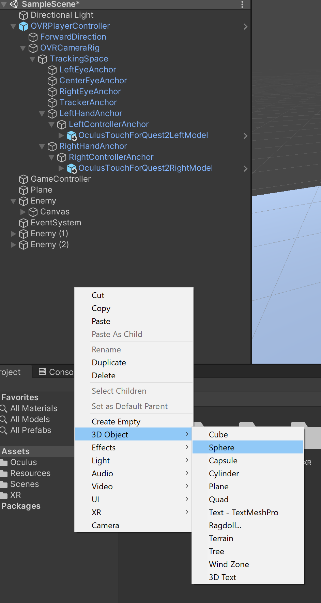
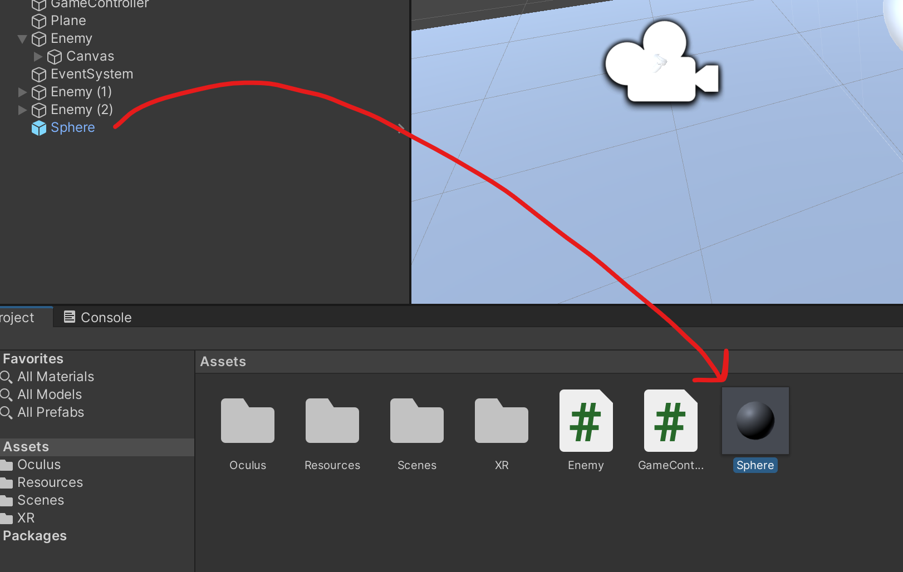
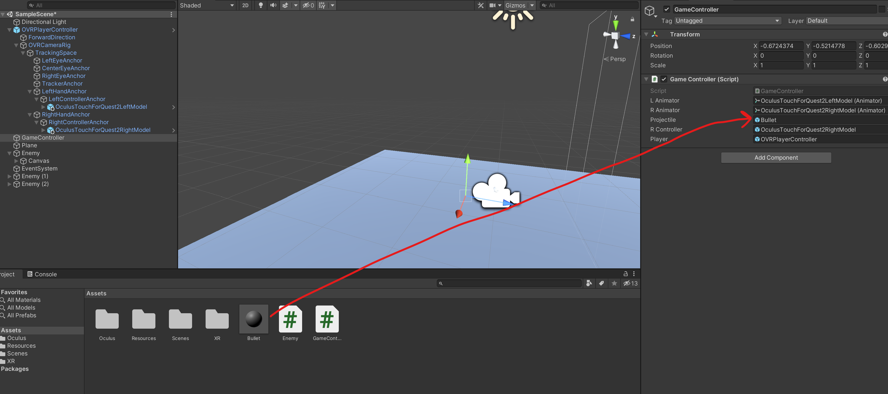

# UnityでVR FPSゲームを作りましょう！
## 射撃の実装
VRの基本の操作が実装できたら弾の実装をしましょう。  
まず、弾のprefabが必要です。prefabとは単にいうとテンプレートみたいなものです。  
弾のprefabは簡単なキューブかスフィアでもいいので、今回はスフィアで作ります。  


これでスフィアが作成されたが、まだprefabではないです。  
prefabにする方法はHierarchyビューからスフィアを引っ張ってProjectビューに置くと完成です。  


prefabを作成できたらHierarchyビューからスフィアを消してもいいです。

次はさっき作成したprefabを名前を"Bullet"と付けて、以下のコードをシーン内のGameObjectのスクリプトに書く。今回はGameControllerといういろいろなものを処理するオブジェクトを作成して使います。
```cs
using System.Collections;
using System.Collections.Generic;
using UnityEngine;

public class GameController : MonoBehaviour {
    public GameObject projectile;

    void Update() {

    }
}
```
以上のように`public GameObject projectile;`を作って、ProjectビューからInspectorビューにあるGameControllerのスクリプトのProjectile欄にBulletを引っ張って置くとコードでこのprefabを使えます。



弾を撃つため、コードの`Update()`内でキーの判定を書いて、以下のように実装する。
```cs
void Update() {
    //テストのため今はキーボードのSpaceキーを使う
    if(Input.GetKeyDown(KeyCode.Space)) {
        GameObject bullet = Instantiate(projectile, transform.position, transform.rotation) as GameObject;
        bullet.GetComponent<Rigidbody>().AddForce(transform.forward * 500);
    }
}
```
以上のコードでテストのためまだVRのコントローラー使用しないが、キーボードのSpaceキーを使います。  
以上のように実装すればゲーム内でSpaceキーを押すとGameControllerの位置から弾が出るはずです。

## 敵の動きの再生成
敵が動かないと簡単すぎるでしょう。なので簡単な敵の動きを作りましょう。  
まず、敵のスクリプトのUpdate()関数の中に以下を書きます。
```cs
void Update() {
    transform.Translate(Vector3.back * Time.deltaTime);
}
```
敵はプレイヤーと同じ方向に向いているのでVector3.backを使います。しかし敵は逆向きになったらVector3.forwardを使います。

次は敵を倒したときにリスポーンするため、オブジェクトを破壊する直前新しいオブジェクトを再生するといいです。
```cs
private void OnCollisionEnter(Collision other) {
    if(other.gameObject.tag == "Bullet") {
        hp -= 25;
        hpText.text = "" + hp;
    }
    if(hp == 0) {
        float spawnX = Random.Range(-4, 4);
        GameObject enemy = (GameObject) Instantiate (gameObject, new Vector3(spawnX,0,7), Quaternion.identity);
        Destroy(gameObject);
    }
}
```

`Destroy(gameObject)`の前に

```cs
float spawnX = Random.Range(-4, 4);
GameObject enemy = (GameObject) Instantiate (gameObject, new Vector3(spawnX,0,7), Quaternion.identity);
```
を書いたら敵を倒したとき、X軸でリスポーンすることになります。