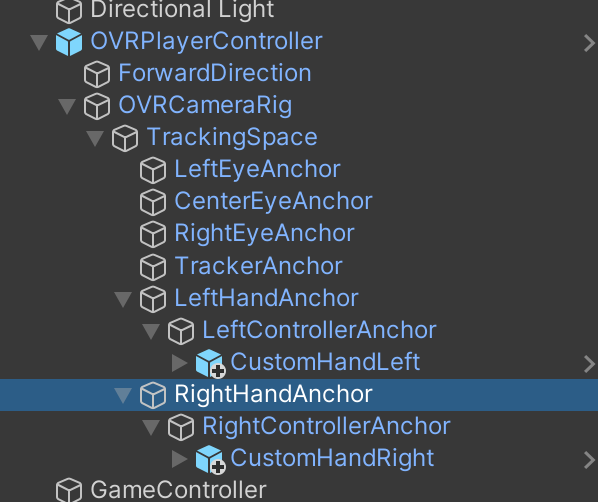

# 銃を実装
## 物を掴む
銃を実装する前に物の掴むも実装しなければならないですよね。  
物を掴むことに必要なスクリプトは`OVRGrabber`と`OVRGrabbable`で、`OVRGrabber`は手元に付けるもので`OVRGrabbable`は掴みたい物に付けることです。

Oculus Integrationの中に実装されたOVRGrabbable付き手のサンプルがあって今回はそれを使っていきます。  
現バージョンそのサンプルは`Oculus > SampleFramework > Core > CustomHands`にあるCustomHandLeftとCustomHandRightです。  
CustomHandLeftとCustomHandRightをOVRPlayerControllerのLeftControllerAnchorとRightControllerAnchorに入れば完了です（すでにコントローラがある場合はコントローラを消すこと、Handはコントローラの一種なのでコントローラとして使います）。

以上の手の実装があったら、掴めるオブジェクトを作りましょう！  
掴みたいオブジェクトに必要なのはOVRGrabbableスクリプトとRigidbodyコンポネントなので、この２つを掴みたいオブジェクトに追加したら掴めることになります。