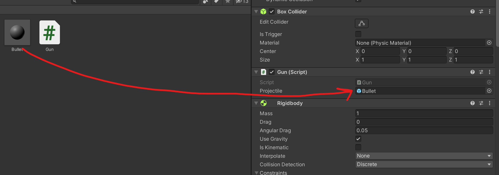

# 銃を実装
## 物を掴む
銃を実装する前に物の掴むも実装しなければならないですよね。  
物を掴むことに必要なスクリプトは`OVRGrabber`と`OVRGrabbable`で、`OVRGrabber`は手元に付けるもので`OVRGrabbable`は掴みたい物に付けることです。

Oculus Integrationの中に実装されたOVRGrabbable付き手のサンプルがあって今回はそれを使っていきます。  
現バージョンそのサンプルは`Oculus > SampleFramework > Core > CustomHands`にあるCustomHandLeftとCustomHandRightです。  
CustomHandLeftとCustomHandRightをOVRPlayerControllerのLeftControllerAnchorとRightControllerAnchorに入れば完了です（すでにコントローラがある場合はコントローラを消すこと、Handはコントローラの一種なのでコントローラとして使います）。


以上の手の実装があったら、掴めるオブジェクトを作りましょう！  
掴みたいオブジェクトに必要なのはOVRGrabbableスクリプトとRigidbodyコンポネントなので、この２つを掴みたいオブジェクトに追加したら掴めることになります。

## 銃を持ちながら弾を撃つ
弾を撃つためにまずは弾のprefabを用意してください。簡単な作り方はHierarchyビューでスフィアを作成してProjectビューにドラッグアンドドロップすればいいです。

弾prefabができたら、銃のオブジェクトに新しいスクリプトを作りましょう。今回は`Gun.cs`と名前を付けます。
スクリプトの中に弾用の変数を作って、パブリック変数にする。
```cs
public GameObject projectile;
```
それからUpdate()メソッド内に弾を撃つコードを書きましょう
```cs
void Update() {
    if (transform.GetComponent<OVRGrabbable>().isGrabbed && OVRInput.GetDown(OVRInput.RawButton.RIndexTrigger)) {
        GameObject launchPos = gameObject.transform.GetChild(0).gameObject;

        GameObject bullet = Instantiate(projectile, launchPos.transform.position, launchPos.transform.rotation) as GameObject;
        bullet.GetComponent<Rigidbody>().AddForce(launchPos.transform.forward * 500);
    }
}
```

最後に弾のprefabをスクリプトに設定すれば完了であるはず。
